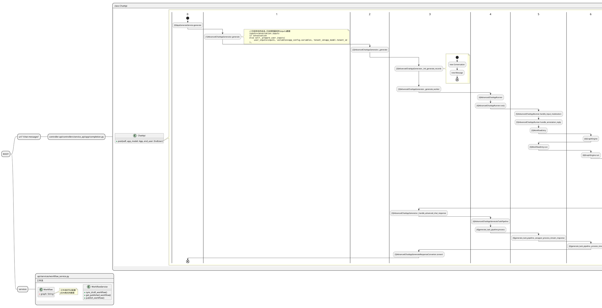

```plantuml
@startmindmap
* ROOT
** url:"/chat-messages"
*** controller:api/controllers/service_api/app/completion.py
****: class ChatApi
----
{{
    class ChatApi{
        + post(self, app_model: App, end_user: EndUser)
    }

    note right of ChatApi::post
    {{
        |0|
        start
        |0|
        :[0]AppGenerateService.generate;
        |1|
        :[1]AdvancedChatAppGenerator.generate;
        note right 
            <code>
                //已经存在的会话,只会使用最初的inputs数据
                inputs=conversation.inputs
                if conversation
                else self._prepare_user_inputs(
                    user_inputs=inputs, variables=app_config.variables, tenant_id=app_model.tenant_id
                ),
            </code>
        end note
        |2|
        :[2]AdvancedChatAppGenerator._generate;
        |3|
        :[3]AdvancedChatAppGenerator._init_generate_records;
        note right 
        {{
            start
            :new Conversation;
            :new Message;
            end
        }}
        end note
        :[3]AdvancedChatAppGenerator._generate_worker;
        |4|
        :[4]AdvancedChatAppRunner;
        :[4]AdvancedChatAppRunner.run();
        |5|
        :[5]AdvancedChatAppRunner.handle_input_moderation;
        :[5]AdvancedChatAppRunner.handle_annotation_reply;
        :[5]WorkflowEntry;
        |6|
        :[6]GraphEngine;
        |5|
        :[5]WorkflowEntry.run;
        |6|
        :[6]GraphEngine.run;
        |7|
        :[7]AnswerStreamProcessor;
        :[7]AnswerStreamProcessor.process;
        |8|
        :[8]GraphEngine._run;
        |9|
        :[9]GraphEngine._run_node;
        :[9]ConditionManager.get_condition_handler;
        :[9]ConditionManager.check;
        |3|
        :[3]AdvancedChatAppGenerator._handle_advanced_chat_response;
        |4|
        :[4]AdvancedChatAppGenerateTaskPipeline;
        :[4]generate_task_pipeline.process;
        |5|
        :[5]generate_task_pipeline._wrapper_process_stream_response;
        |6|
        :[6]generate_task_pipeline._process_stream_response;
        |3|
        :[3]AdvancedChatAppGenerateResponseConverter.convert;
        |0|
        end
    }}
    end note
}}
;

** services
***: api/services/workflow_service.py
----
工作流
----
{{
    class WorkflowService{
        + sync_draft_workflow()
        + get_published_workflow()
        + publish_workflow()
    }

    class Workflow{
        - graph: String 
    }

    note right of Workflow::graph
        工作流的节点配置
        JSON格式的数据
    end note
}}
;

@endmindmap
```